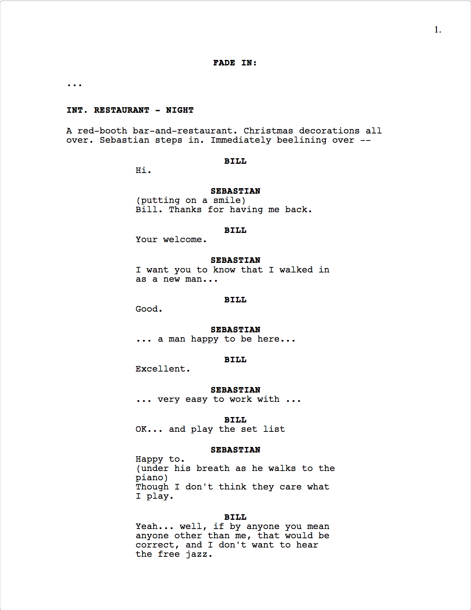

### A movie script writing tool (MAC only)
---

It's usable now, but still under development... no electron/nedb yet   

    npm i && npm start  

open localhost:3000   

---

---
Basic use: pretty much like Final Draft, short-cut:

- ctrl+1: Scene
- ctrl+2: Action
- ctrl+3: Character
- ctrl+4: Parethetical
- ctrl+5: Dialogue
- ctrl+6: Transition
- ctrl+7: Shot

Print: command+p, you can print your script as PDF (optimization: US Letter)

---

*TODO:*
- Add saving
- Add paragraph collections
- Add script chart
- Maybe use div-contentEditable instead of semantic-ui-Textarea, so it's pure react app with no third-party package
- Add some test

---

*TRY TO:*  
- As simple as possible
- Just writing, no bullshit
- .fdx convert

---

**based-on**:  
~~`electron`~~ `REACT` `mobx` ~~`nedb`~~

---

**key component**:  
- **page**: make a standard movie script looking, handling key-map shortcut function, like `cmd+1 => scene`, `cmd+5 => dialogue` and so on ...
- **paragraph**: `General`, `Scene Heading`, `Action`, `Character`, `Parenthetical`, `Dialogue`, `Transition`, `Shot`, `Cast List`
- ~~**title page**~~
- ~~**tool sider**: open, save, new, convert ...~~
- ~~**tool script**: collection of `Scene`, `Character`, `Shot`~~ ...

**mobx script**:  

    {script:
      {
        titlePage:
        {
          Title: 'LA LA LAND',
          By-line: 'Damien Chazelle'
        },
        Paragraph: [
          ...
          {$Type: 'General'},
          {$Type: 'Action', _ :
            'Mia gathers her nerves. Gets up. And steps in.'
          },
          ...
          {$Type: 'Scene Heading' , _ :
          {
            Location: 'INI. AUDITION OFFICE',
            Time: 'AFTERNOON'
          },
          ...
          {$Type: 'Shot', _ :
            'WE RETURN to the AUDITION ROOM... Brandt and Frank waiting...'
          },
          ...
          },
          {$Type: 'Character', _ :  
            'MIA'
          },
          {$Type: 'Dialogue', _ :
            "
              Here's to the ones who dream, Foolish as they may seem. Here's to the hearts that ache. Here's to the mess we make...
            "
          },
          ...
        ]
      }
    }
